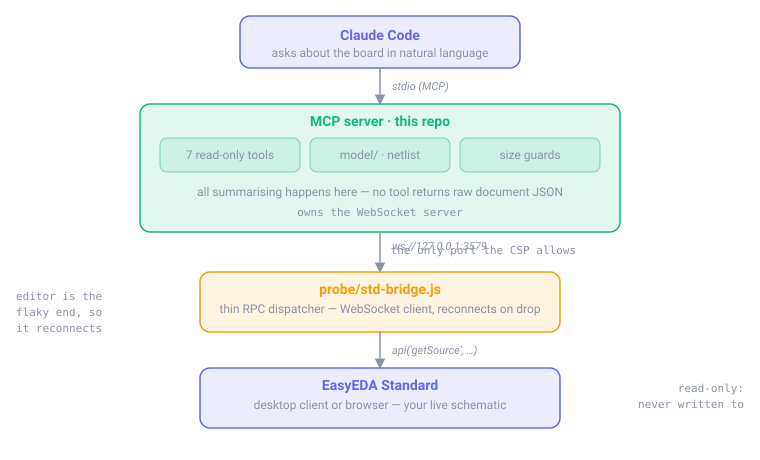

<div align="center">

# EasyEDA STD MCP

**Ask Claude about your live EasyEDA Standard schematic — no exports, no screenshots.**

[](https://modelcontextprotocol.io)
[](https://easyeda.com)
[](https://nodejs.org)
[](https://www.typescriptlang.org)
[](#testing)
[](#writes-are-guarded)
[](LICENSE)

</div>

---

> [!IMPORTANT]
> **EasyEDA Standard, not Pro.** Almost every EasyEDA tool you'll find online targets **Pro**,
> whose API is a completely different surface (`eda.sys_*`, `.eext` packaging, promise-based).
> Std uses a single global `api('method', {params})` dispatcher. If you're on Pro, this repo
> won't help you.

Std is in vendor-declared maintenance mode, so third-party tooling migrated to Pro and no MCP
server existed for Std. This is one, built from scratch by reverse-engineering the live editor.

**Ten tools:** seven read-only, three for guarded writes. Schematics only.

## What it does

<div align="center">
  
</div>

## Demo

Once attached, you just ask. Output below is from the repo's synthetic test board, so you can
reproduce it yourself with `npm test` and no EasyEDA at all.

**"Trace the SDA net"**

```
Net SDA — 4 connection(s).

Designator  Pin  Pin name  Component
----------  ---  --------  -----------
J1          3    SDA       CONN-4P
R1          1    1         10kΩ
U2          3    SDA       MCU32-A
U3          3    SDA       TEMP-SENS-A
```

**"What's on U2?"**

```
U2 — MCU32-A

  Footprint              QFN-24_L4.0-W4.0-P0.50
  Manufacturer           GenericSemi
  Supplier part (LCSC)   C7001003
  In BOM                 yes

Pins (8):

Pin  Name   Net            Net pins
---  -----  -------------  --------
1    VDD    +3V3           9
2    GND    GND            12
3    SDA    SDA            4
4    SCL    SCL            5
5    XIN    N$1            2
6    XOUT   N$2            2
7    LED    N$3            2
8    RESET  (unconnected)  -

1 pin(s) are on no net.
```

An unconnected pin says so. It does **not** get a made-up net id — every pin forms a graph
node whether or not a wire reaches it, and reporting those as nets would be quietly wrong.

**"List the nets"**

```
9 nets (5 named, 4 unnamed local nets). 3 unconnected pin(s) excluded.

Net   Kind   Pins  Connections
----  -----  ----  ---------------------------
GND   named  12    C1.2 C2.2 C3.2 C4.2 C5.2 +7
+3V3  named  9     C2.1 C3.1 C4.1 C6.1 R1.2 +4
SCL   named  5     J1.4 R2.1 R4.1 U2.4 U3.4
VBUS  named  5     C1.1 C5.1 J1.1 U1.1 U1.3
SDA   named  4     J1.3 R1.1 U2.3 U3.3
N$1   local  2     U2.5 Y1.1
```

GND is drawn as twelve separate ground symbols with no wire between them, and comes back as
one twelve-pin net. That merge is the single easiest thing to get wrong here — see below.

**"Give me the BOM"**

```
12 BOM lines covering 17 components. 1 component(s) excluded (marked add_into_bom=no): H1.

Qty  Name         Footprint               LCSC      Manufacturer    Designators
---  -----------  ----------------------  --------  --------------  --------------
4    100nF        C0402                   C7002001  GenericPassive  C1, C2, C3, C4
2    10kΩ         R0402                   C7003001  GenericPassive  R1, R2
2    10uF         C0805                   C7002002  GenericPassive  C5, C6
1    10kΩ         R0603                   C7003003  GenericPassive  R4
1    16MHz        CRYSTAL-SMD-3225        C7001005  GenericXtal     Y1
1    LDO33-A      SOT-23-5                C7001002  GenericSemi     U1
1    MCU32-A      QFN-24_L4.0-W4.0-P0.50  C7001003  GenericSemi     U2
```

Two separate `10kΩ` lines, because R0402 and R0603 are not interchangeable. Grouping by value
alone would merge parts you cannot substitute. The mounting hole marked `add_into_bom=no` is
excluded — and *reported*, so its absence is visible rather than silent.

## Tools

| Tool | What it gives you |
|---|---|
| `easyeda_doctor` | End-to-end diagnosis. **Run this first.** |
| `easyeda_get_context` | Document type, size, collection counts — cheap orientation |
| `easyeda_list_components` | Designator, name, footprint, LCSC part, pin count — with filter |
| `easyeda_list_nets` | Every net with connection counts |
| `easyeda_trace_net` | Every pin on a net, with the owning component |
| `easyeda_get_component` | One part in full, including each pin's net |
| `easyeda_get_bom` | Grouped BOM with quantities and designators |

### Write tools

| Tool | What it does |
|---|---|
| `easyeda_edit_components` | Set value / designator / footprint / LCSC / manufacturer on one or many parts. **Previews by default.** |
| `easyeda_list_backups` | Restore points, newest first |
| `easyeda_restore_backup` | Roll the live document back to a restore point |

## Install

**Requirements:** Node ≥ 20, and EasyEDA **Standard** (desktop client or browser).

```bash
git clone https://github.com/KfirLevy258/EasyEDA-STD-MCP.git
cd EasyEDA-STD-MCP
npm install
npm run build
```

Register with Claude Code:

```bash
claude mcp add easyeda -- node "$(pwd)/dist/src/server/index.js"
```

### Attach the editor

With a board open in EasyEDA Standard:

**`Advanced` → `Extensions` → `Run Script…` → `Load from js file…` → pick `probe/std-bridge.js` → `Run`**

Then ask Claude to run `easyeda_doctor`. You want:

```
  [ok]   bridge server listening on 127.0.0.1:3579
  [ok]   editor attached (protocol easyeda-std-bridge/0.1)
  [ok]   RPC round-trip works
  [ok]   document open: schematic, ~412 KB

STATE: connected, document open. Ready.
```

The bridge lasts until the editor page reloads, and reconnects by itself if the MCP server
restarts. Re-run the script after reloading EasyEDA.

> [!TIP]
> **Load it from the file — don't bootstrap with `fetch(...).then(eval)`.** That evaluates in
> global scope, where the editor's injected `api()` isn't visible. `api` is not on `window`.

## Troubleshooting

`easyeda_doctor` distinguishes three failure states, each with a different fix.

<details>
<summary><b>"no EasyEDA editor attached"</b></summary>

The bridge script isn't running. Re-run it (`Advanced → Extensions → Run Script…`). If you
reloaded the editor, the script is gone and must be re-run.
</details>

<details>
<summary><b>"connected, but no document is open"</b></summary>

EasyEDA needs an **active document tab**. The Start page doesn't count — open a schematic.
</details>

<details>
<summary><b>"port 3579 is already in use"</b></summary>

Another copy of this server, or EasyEDA's own local helper, holds the port. Free it and
restart. **Do not change the port** — see below.
</details>

<details>
<summary><b>Nothing happens at all — no errors anywhere</b></summary>

Almost certainly the port. The desktop client injects a CSP whose `connect-src` allows exactly:

```
connect-src wss: https: blob: 'self' http://127.0.0.1:3579 ws://127.0.0.1:3579;
```

Any other port is blocked by Chromium **before a packet is sent** — no error event, no traffic,
complete silence. That silence is the signature. The port is not configurable.
</details>

## Writes are guarded

Writing is real, and there is **no sandbox**. `applySource` overwrites whatever document
is open. `createNew: true` is documented as opening a new tab — it does not (see
[FINDINGS.md §11](FINDINGS.md)); it overwrites in place. And it returns `undefined`
whether it succeeded or was never dispatched, so its return value proves nothing.

Everything about the write path follows from those three facts:

```
snapshot to disk → edit in memory → integrity check → write
                 → read back      → verify          → roll back on mismatch
```

**Preview is the default.** An edit shows you exactly what would change and writes nothing:

```
Designator  Field         From         To
----------  ------------  -----------  -------
U2          manufacturer  GenericSemi  NewCorp

PREVIEW ONLY — 1 change(s) not yet written.
Re-run with apply: true to write them to the editor.
```

With `apply: true`, a restore point is written **before** the change, and the result is
read back and structurally verified:

```
Restore point saved: 2026-08-15T20-55-42-503Z__before-manufacturer-1

Applied 1 of 1 change(s). Structure verified unchanged:
  components 18, wires 18, nets 12, orphan pins 0
```

If verification finds the topology moved — a component gone, a net's pin count changed,
two rails merged — the write is **rolled back automatically** and reported.

Other guarantees, each enforced by a test rather than by convention:

- `applySource` has exactly **one call site**, so there is a single place to audit.
- Read-only tools cannot reach the write path.
- An edit with neither `designators` nor `filter` is **refused**, not applied to every part.
- The restore point is saved *before* the write, never after.
- `createShape` / `updateShape` exist in the API but stay unused until they get the same gating.

## How it works

EasyEDA Std turned out to be more awkward than documented. The findings that shaped the design
are written up in **[FINDINGS.md](FINDINGS.md)**; the highlights:

- **`api` is not a `window` global.** It's injected into user-script scope only, so the bridge
  must live in a user script — driving the editor from devtools or CDP is impossible.
- **The dispatcher silently swallows unknown method names.** `api('nope')` returns `undefined`
  with no error. A typo is indistinguishable from an empty result.
- **`edit.unitConvert` does not exist**, despite being documented.
- **There is no netlist.** Wires carry only geometry, pins only a coordinate, and net names live
  on separate `netflag` objects. Connectivity is reconstructed with union-find over coordinates.

That last one has two traps that produce a *plausible but wrong* netlist, both now regression-tested:

1. **Wires are polylines** (2–8+ points), not segments. Reading only endpoints drops connections.
2. **Same-named netflags are one net.** Global labels aren't wired together — on the reference
   board `GND` is 120 separate symbols. Miss the merge and GND fragments into 120 one-pin "nets",
   which looks entirely reasonable and is completely wrong.

The model reports `orphanPins` and `nameConflicts` on every extraction; both must be zero, and
the tools warn loudly if they aren't.

## Testing

```bash
npm test
```

The model layer is pure, so **every tool is testable with EasyEDA closed**, against a committed
synthetic fixture built to contain each awkward case above:

```
ℹ tests 20
ℹ pass 20
ℹ fail 0
```

A clean clone passes with no setup and no EasyEDA installed. Regenerate the synthetic board with:

```bash
node test/fixtures/make-synthetic.mjs
```

Against a live editor:

```bash
WAIT_MS=9000 node test/e2e-client.mjs easyeda_doctor
node test/e2e-client.mjs 'easyeda_list_components::{"filter":"0402"}'
```

### Context discipline

`getSource` on a real schematic returns **~888 KB** — roughly a quarter of a million tokens.
No tool returns raw document JSON; every one summarises server-side, and tests assert the output
stays small and leaks no geometry. Treat a full dump as a bug.

## Limitations

- **Schematics only.** PCB documents are detected and declined rather than guessed at.
- **Writes cover component fields**, not geometry. Placing, moving and routing would need
  `createShape`/`updateShape`, which are unimplemented — and because nets are derived from
  coordinates, moving anything can silently break connectivity.
- No DRC, no fabrication export, no supplier API.
- Port 3579 is whitelisted because EasyEDA presumably intends it for its own local helper.
  It isn't ours by right; a collision is possible.
- `probe/std-bridge.js` includes an `__eval` escape hatch used to reverse-engineer the API.
  It must not ship in a packaged extension.

## License

MIT
